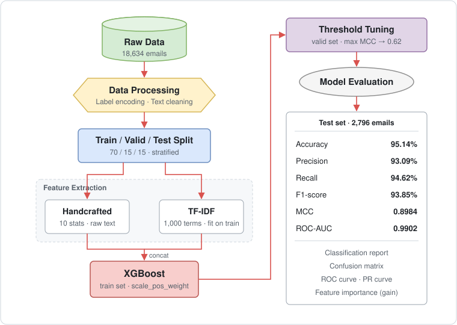

# Applying-XGBoost-to-Detect-Phishing-Emails

使用 XGBoost 建立釣魚郵件（Phishing Email）與安全郵件（Safe Email）的二元分類模型，結合統計特徵與 TF-IDF 特徵，並以驗證集的 MCC 選取最佳決策門檻。

## 資料來源

[Phishing Email Dataset](https://www.kaggle.com/datasets/subhajournal/phishingemails)（Kaggle）。移除遺失值後共 18,634 封郵件，其中 `Safe Email` 11,322 封、`Phishing Email` 7,312 封。

## 系統流程

統計特徵包含：字數、不重複字數、停用詞數、超連結數、Email 地址數、特殊字元數、數字數、緊急關鍵字數（如 urgent、verify、password）、平均字長、全大寫字數。

## 資料切分與評估方式

資料以分層抽樣（stratified sampling）切分為訓練、驗證、測試三組，三組的類別比例一致（Safe 約 60.8%、Phishing 約 39.2%）：

| 資料集 | 比例 | 筆數 | 用途 |
|------|------|------|------|
| 訓練集 | 70% | 13,043 | 擬合 TF-IDF、訓練模型 |
| 驗證集 | 15% | 2,795 | 選取決策門檻 |
| 測試集 | 15% | 2,796 | 最終評估（僅使用一次） |

為避免資料洩漏（data leakage）：

- 先切分資料，TF-IDF 只以訓練集擬合，驗證集與測試集只做轉換
- 決策門檻在驗證集上以 MCC 選取（搜尋範圍 0.30–0.70），最佳門檻為 **0.62**
- 測試集不參與任何調整

## 主要結果

| 指標 | 數值 |
|------|------|
| Accuracy | 95.14% |
| Precision | 93.09% |
| Recall | 94.62% |
| F1-score | 93.85% |
| MCC | 0.8984 |
| ROC-AUC | 0.9902 |

Precision 與 Recall 相近，Recall 略高，初步顯示模型在漏判與誤報之間大致平衡。

Notebook 另附門檻靈敏度分析、混淆矩陣、ROC 曲線、PR 曲線與特徵重要性（Gain）等圖表。

## 備註

- 本專案僅供學習與研究用途，模型結果不應直接應用於正式的郵件安全防護系統。
